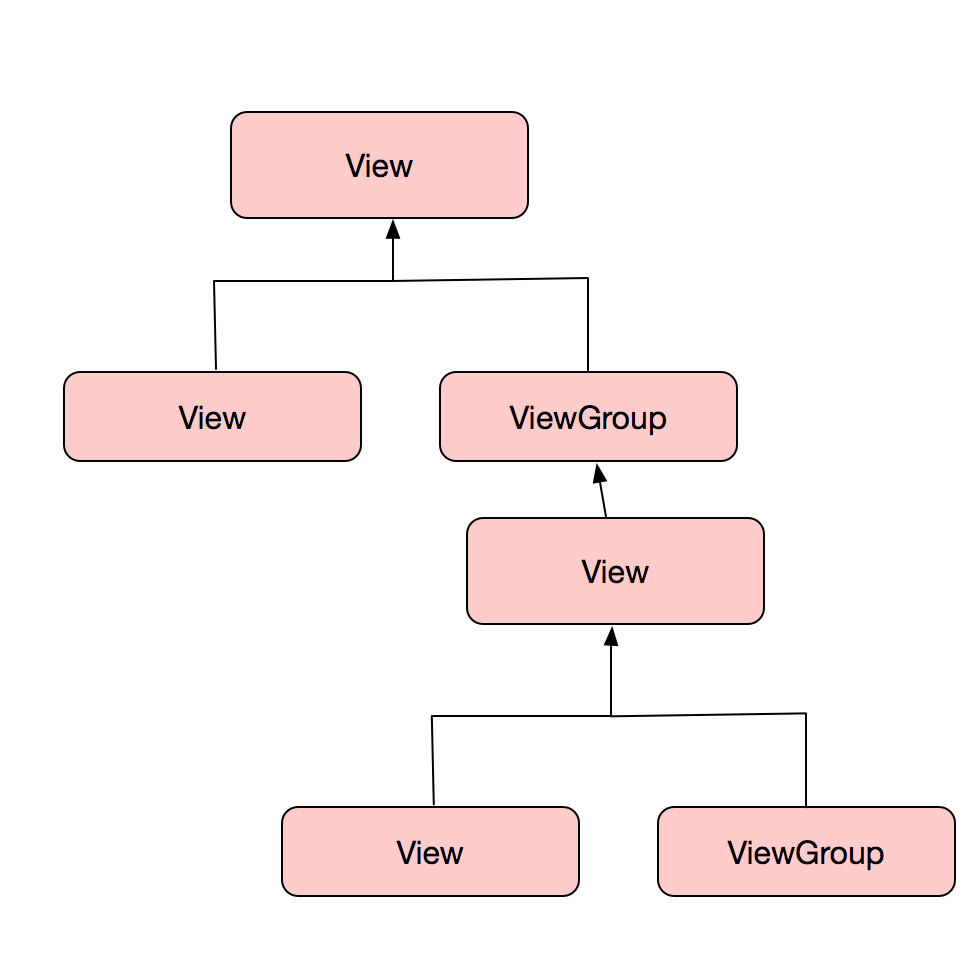

# View的事件体系

​	

## 1. 基础知识

	### 1.1 View简介

View是所有Android显示控件的基类,View可以嵌套显示,形成一个类似于DOM的树形结构,可以以下面的一张图很明显的说明.

	### 1.2 View的位置参数

View是一块矩形的显示区域,由View的四个顶点指定位置.

## 2. View的滑动

## 3. 弹性滑动

## 4. View的事件分发机制

## 5. 解决滑动冲突

